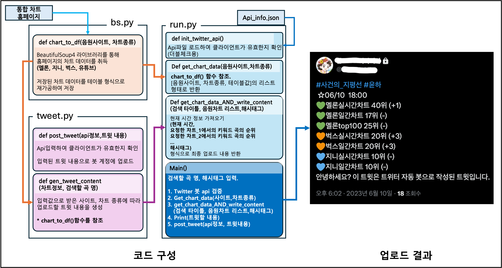
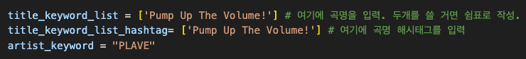

# 음원 사이트 랭킹 트윗 봇

## 이게 뭔가요?
* 원하는 가수/아이돌 그룹 등의 음원 순위를 음원 스트리밍 서비스 사이트 별 현재 순위를 트윗하는 트위터(현 X) 봇 프로그램입니다.

## 왜 만들었나요?
* 주로 아이돌 그룹의 컴백 시즌에 팬덤들이 특정 음원 스트리밍을 반복하여 차트 높은 차트 순위를 유지하는 **"스밍 총공"** 을 진행할 때, **스밍 총공팀의** 보조 모니터링 및 스트리밍 독려용으로 활용됩니다.

## 어떻게 작동하나요?


## 사용 방법
### 계정 API 키 발급
**스크린샷 추가예정...**
https://developer.x.com/en/portal/dashboard

* 발급받은 API키를 다음과 같은 형태의 json파일에 입력
```
{
    "API_KEY":"SAMPLE_API_KEY",
    "API_SECRET":"SAMPLE_API_SECRET",
    "ACCESS_KEY":"SMAPLE_ACCESS_KEY",
    "ACCESS_SECRET":"SAMPLE_ACCESS_SECRET",
    "CLIENT_ID":"SAMPLE_ID",
    "CLIENT_SECRECT":"SAMPLE_PW",
    "BEARER_TOKEN":"SAMPLE_TOKEN"
 }
```

### 필요한 패키지 설치

```bash
pip install bs4
pip install pandas
pip install tweepy
```

### 파이썬 스크립트 실행
run.py 파일 내의 변수에 키워드 입력

```bash
python run.py
```
## HELLO WORLD!